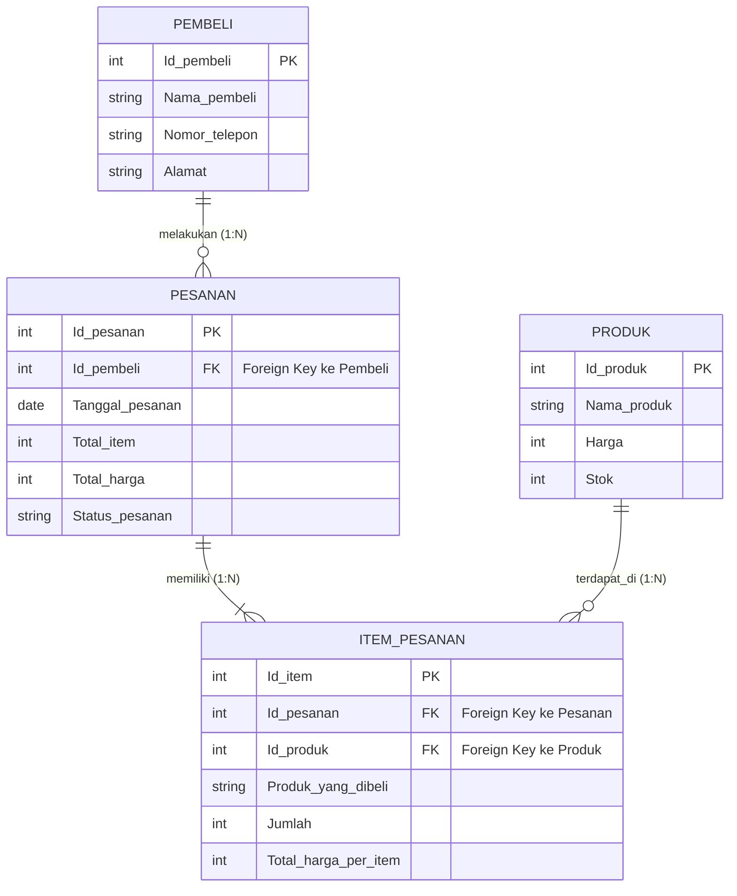

```mermaid
erDiagram
    PEMBELI ||--o{ PESANAN : "melakukan (1:N)"
    PESANAN ||--|{ ITEM_PESANAN : "memiliki (1:N)"
    PRODUK ||--o{ ITEM_PESANAN : "terdapat_di (1:N)"

    PEMBELI {
        int Id_pembeli PK
        string Nama_pembeli
        string Nomor_telepon
        string Alamat
    }

    PRODUK {
        int Id_produk PK
        string Nama_produk
        int Harga
        int Stok
    }

    PESANAN {
        int Id_pesanan PK
        int Id_pembeli FK "Foreign Key ke Pembeli"
        date Tanggal_pesanan
        int Total_item
        int Total_harga
        string Status_pesanan
    }

    ITEM_PESANAN {
        int Id_item PK
        int Id_pesanan FK "Foreign Key ke Pesanan"
        int Id_produk FK "Foreign Key ke Produk"
        string Produk_yang_dibeli
        int Jumlah
        int Total_harga_per_item
    }
```